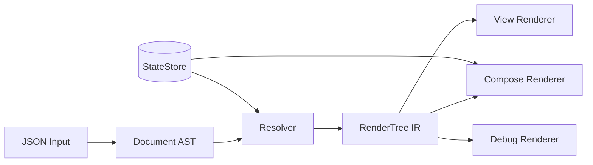

# SCALS Android Port - Prompt Considerations

## Current Architecture Understanding

The iOS SCALS framework follows an LLVM-inspired multi-stage pipeline:



---

## What to INCLUDE in the Prompt

### 1. Core Pipeline Architecture (Essential)

The rendering pipeline is platform-agnostic and should be central to the prompt:

- JSON parsing → Document (AST) → Resolution → RenderTree (IR) → Renderer
- Clear separation between parsing, resolution, and rendering phases
- Include the [RenderingPipeline.md](ScalsRenderer/Docs/RenderingPipeline.md) documentation

### 2. JSON Schema Definition (Essential)

- Include [scals-document-latest.json](ScalsRenderer/SCALS/Schema/scals-document-latest.json) - identical schema ensures cross-platform compatibility
- Document structure: `id`, `version`, `state`, `styles`, `dataSources`, `actions`, `root`
- This is the contract between server and client

### 3. The 5 SCALS Components (Essential)

| Component | Include | Why |

|-----------|---------|-----|

| **C**omponents | Full docs + types | Component types (label, button, textfield, image, gradient, toggle, slider, divider) map well to Android |

| **L**ayouts | Full docs + types | VStack/HStack/ZStack → Column/Row/Box, SectionLayout → LazyColumn/LazyRow |

| **A**ctions | Full docs + types | Action system (dismiss, setState, showAlert, sequence, navigate) is platform-agnostic |

| **D**ata | Full docs + types | DataSources, bindings, templates - StateStore concept translates to StateFlow |

| **S**tyles | Full docs + resolution algorithm | Style inheritance algorithm is pure logic, just needs type mapping |

### 4. Type Namespacing Strategy (Essential)

- `Document.*` namespace for AST types (parsed JSON)
- `IR.*` namespace for resolved types
- `RenderNode` types for render-ready structures
- Include [Document.swift](ScalsRenderer/SCALS/Document/Document.swift) and [IR.swift](ScalsRenderer/SCALS/IR/IR.swift) as reference

### 5. Resolver Architecture (Essential)

- Resolution context pattern
- Style resolution with inheritance
- Data binding resolution
- Action resolution
- Include [Resolver.swift](ScalsRenderer/SCALS/IR/Resolver.swift) as reference

### 6. StateStore Pattern (Essential)

- Observable state with key-path access
- Dirty tracking for efficient updates
- Template interpolation (`${variable}` syntax)
- Expression evaluation (`$expr` for dynamic values)
- Include [StateStore.swift](ScalsRenderer/SCALS/State/StateStore.swift) as reference

### 7. Extensibility Architecture (Essential)

- Component registration pattern
- Plugin system for external modules
- Registry pattern for resolvers and renderers
- Include [ComponentRegistration.swift](ScalsRenderer/SCALS/Extensibility/ComponentRegistration.swift) as reference

### 8. Unit Tests (Important)

- Include key tests from `SCALSTests/` to demonstrate expected behavior
- Document parsing tests, resolution tests, state tests

---

## What to ADAPT for Android

### 0. Idiomatic Kotlin Patterns (Required)

The Android implementation MUST use idiomatic Kotlin throughout. Explicitly require:

| Kotlin Feature | Use Case in SCALS |

|----------------|-------------------|

| **Sealed classes** | `RenderNode`, `ActionDefinition`, `StateValue`, `Document.LayoutNode` - perfect for exhaustive when expressions |

| **Data classes** | All immutable types: `Document.Definition`, `IR.Style`, `TextNode`, `ButtonNode`, etc. |

| **Extension functions** | Color parsing (`String.toColor()`), style merging, type conversions |

| **Object declarations** | Namespacing (`Document`, `IR`), singletons for registries |

| **Companion objects** | Factory methods, constants |

| **Inline classes / value classes** | Type-safe IDs (`StyleId`, `ActionId`) |

| **DSL builders** | Optional - for building test documents or configurations |

| **Coroutines + Flow** | StateStore observability, async action execution |

| **Null safety** | Leverage Kotlin's null safety instead of optional patterns |

**Example Swift → Kotlin mappings:**

```swift
// Swift: enum with associated values
public enum RenderNode {
    case text(TextNode)
    case button(ButtonNode)
    case container(ContainerNode)
}
```
```kotlin
// Kotlin: sealed class hierarchy
sealed class RenderNode {
    data class Text(val node: TextNode) : RenderNode()
    data class Button(val node: ButtonNode) : RenderNode()
    data class Container(val node: ContainerNode) : RenderNode()
}
```
```swift
// Swift: namespace enum
public enum Document {
    public struct Definition: Codable { ... }
}
```
```kotlin
// Kotlin: object for namespace
object Document {
    @Serializable
    data class Definition(...)
}
// Or use package-level organization
```

### 1. Rendering Layer

| iOS | Android Equivalent |

|-----|-------------------|

| SwiftUI `View` | Jetpack Compose `@Composable` |

| UIKit `UIView` | Android `View` / `ViewGroup` |

| `EnvironmentObject` | `CompositionLocal` or Hilt DI |

| SwiftUI modifiers | Compose `Modifier` |

### 2. Reactive State

| iOS | Android Equivalent |

|-----|-------------------|

| `@Published` / Combine | `StateFlow` / `MutableStateFlow` |

| `@MainActor` | `Dispatchers.Main` / `@MainThread` |

| `ObservableObject` | `ViewModel` with `StateFlow` |

### 3. Platform Types

| iOS Type | Android Equivalent |

|----------|-------------------|

| `Color` (SwiftUI) | `Color` (Compose) or `@ColorInt` |

| `Font.Weight` | `FontWeight` (Compose) |

| `NSDirectionalEdgeInsets` | `PaddingValues` |

| `SwiftUI.Alignment` | `Alignment` / `Arrangement` |

| SF Symbols | Material Icons / Custom icon system |

| `URL` | `Uri` or `String` |

### 4. Serialization

| iOS | Android Equivalent |

|-----|-------------------|

| `Codable` | `kotlinx.serialization` or Moshi/Gson |

| `JSONDecoder` | Kotlin serialization `Json` |

### 5. Platform-Specific Behaviors

- Safe area handling (different on Android)
- Navigation patterns (Navigation component vs iOS presentation styles)
- Alert dialogs (Android Dialog vs iOS UIAlertController)
- Keyboard handling

---

## What to Potentially EXCLUDE/Simplify

### 1. Swift-Specific Syntax → Translate to Kotlin Idioms

| Swift Pattern | Kotlin Equivalent |

|---------------|-------------------|

| Protocol extensions | Extension functions on interfaces |

| Property wrappers (`@Published`) | `StateFlow` / Compose `State` |

| `@EnvironmentObject` | `CompositionLocal` or DI |

| Enum associated values | Sealed classes with data class variants |

| `Codable` conformance | `@Serializable` annotation |

| Optional chaining (`?.`) | Same in Kotlin, plus `?.let {}` |

| Guard statements | `require()`, `check()`, early returns |

### 2. UIKit Implementation Details

- Focus on Compose-first approach (like focusing on SwiftUI)
- Traditional View system can be secondary
- UIKit-specific APIs and view hierarchies

### 3. Combine Framework Specifics

- Replace with Kotlin Flow concepts
- No need to explain Combine publishers/subscribers

### 4. Apple Platform Specifics

- SF Symbols details
- Safe area specific implementations
- iOS-specific presentation styles

---

## Key Questions to Address in the Prompt

1. **Compose vs View Priority**: Should the prompt prioritize Jetpack Compose (modern) or traditional Views (legacy support)?

2. ~~**Kotlin Language Features**: Should sealed classes, data classes, and extension functions be explicitly requested?~~ **ANSWERED**: Yes - use idiomatic Kotlin throughout (sealed classes, data classes, extension functions, coroutines/Flow)

3. **Dependency Injection**: Should Hilt/Koin/manual DI be specified for the registry pattern?

4. **Testing Strategy**: Should it include unit tests, UI tests, or snapshot tests?

5. **Modularization**: Should it be a single module or multi-module library?

6. **Serialization Library**: kotlinx.serialization (recommended for multiplatform potential) or Moshi (more flexibility)?

7. **Minimum SDK Level**: API 21 (broad support) vs API 26+ (modern APIs, Java 8 time)?

8. **Image Loading Library**: Coil (Compose-native) vs Glide (more mature)?

9. **Material Design Integration**: Should styles map to Material 3 tokens, or remain independent?

10. **StateStore Scoping**: ViewModel-scoped? Composition-scoped? Singleton?

11. **Navigation Integration**: Use Navigation Component, or abstract navigation for flexibility?

---

## Additional Android-Specific Considerations

### 1. Android Lifecycle & State Persistence

| Consideration | Details |

|---------------|---------|

| **Configuration changes** | Handle rotation, dark mode changes, locale changes without losing state |

| **Process death** | `SavedStateHandle` integration for surviving process death |

| **ViewModel scoping** | Where does StateStore live? Activity? Fragment? NavGraph? |

| **Lifecycle-aware collection** | Use `collectAsStateWithLifecycle()` for Flow in Compose |

### 2. Navigation Differences

| iOS Pattern | Android Consideration |

|-------------|----------------------|

| `push` presentation | Navigation Component `navigate()` |

| `sheet` presentation | BottomSheetDialogFragment or ModalBottomSheet (Compose) |

| `fullScreen` presentation | Full-screen Activity or Compose destination |

| Dismiss action | `popBackStack()` or `finish()` |

| **Back button** | Must handle system back - iOS doesn't have this |

| **Deep linking** | Android deep link URI patterns differ from iOS |

### 3. Image Loading

- iOS uses built-in `AsyncImage` / `UIImage`
- Android needs an image loading library:
  - **Coil** (Compose-first, recommended)
  - Glide
  - Picasso
- Consider: placeholders, error states, caching, memory management

### 4. Performance Considerations

| Area | Android Specifics |

|------|-------------------|

| **Recomposition** | Compose stability - ensure data classes are stable |

| **Lazy layouts** | `LazyColumn`/`LazyRow` for SectionLayout (like iOS LazyVStack) |

| **JSON parsing** | Consider background thread parsing for large documents |

| **Memory** | Android has stricter memory limits than iOS |

### 5. Accessibility

| Feature | Implementation |

|---------|----------------|

| Screen readers | TalkBack support via `contentDescription` / `semantics {}` |

| Touch targets | Minimum 48dp touch targets (Material guidelines) |

| Font scaling | Support user font size preferences |

| Color contrast | WCAG compliance for text/background |

### 6. Theming & Design System

| Consideration | Details |

|---------------|---------|

| **Material Design 3** | Should SCALS styles map to Material theme tokens? |

| **Dynamic colors** | Android 12+ wallpaper-based colors (Material You) |

| **Dark mode** | `isSystemInDarkTheme()` for adaptive gradients |

| **Shape system** | Material shape tokens vs arbitrary corner radius |

### 7. Error Handling & Validation

| Scenario | Handling |

|----------|----------|

| Invalid JSON | Graceful degradation, error UI, logging |

| Missing style reference | Fall back to defaults vs throw |

| Invalid state path | Null/default vs exception |

| Network image failure | Placeholder, retry logic |

| Malformed expressions | Safe evaluation with fallbacks |

### 8. Threading & Concurrency

| iOS Pattern | Android Equivalent |

|-------------|-------------------|

| `@MainActor` | `Dispatchers.Main`, `withContext(Dispatchers.Main)` |

| Main thread assertions | `checkMainThread()` or `@MainThread` annotation |

| Background work | `Dispatchers.IO`, `Dispatchers.Default` |

| Structured concurrency | `CoroutineScope`, `viewModelScope`, `lifecycleScope` |

### 9. Developer Experience

| Feature | Purpose |

|---------|---------|

| **Debug renderer** | Text dump of render tree (already in iOS) |

| **Logging** | Timber or custom logger integration |

| **Compose Preview** | `@Preview` support for SCALS components |

| **Android Studio tooling** | Layout inspector compatibility |

| **Hot reload** | Compose hot reload should "just work" |

### 10. Security Considerations

| Risk | Mitigation |

|------|------------|

| JSON injection | Schema validation before parsing |

| Arbitrary code execution | Sandbox expression evaluator |

| Custom action abuse | Whitelist allowed action types |

| Remote image URLs | URL validation, HTTPS enforcement |

### 11. Internationalization

| Feature | Consideration |

|---------|---------------|

| **RTL support** | `LayoutDirection`, start/end vs left/right |

| **String resources** | Server strings vs local resources |

| **Number formatting** | Locale-aware formatting in templates |

| **Plurals** | Template system may need plural support |

### 12. Build & Distribution

| Aspect | Details |

|--------|---------|

| **Min SDK** | API 21? 24? 26? Affects available APIs |

| **ProGuard/R8** | Keep rules for serialization classes |

| **Library packaging** | AAR distribution, Maven publishing |

| **Compose BOM** | Version alignment with Compose libraries |

---

## Recommended Prompt Structure

1. **Overview Section**: Explain SCALS purpose and pipeline architecture
2. **JSON Schema Section**: Provide the schema as the contract
3. **AST Types Section**: Document namespace types with Kotlin mappings suggested
4. **IR Types Section**: IR namespace types
5. **Resolution Section**: Resolver logic and algorithms
6. **State Management Section**: StateStore pattern
7. **Rendering Section**: Abstract renderer pattern, then Compose-specific
8. **Extensibility Section**: Registry and plugin patterns
9. **Example Documents**: Working JSON examples for validation
10. **Test Cases**: Key behavioral expectations

---

## Files to Potentially Bundle with the Prompt

| Category | Files |

|----------|-------|

| Documentation | `README.md`, `Docs/*.md` (all 9 docs) |

| Schema | `scals-document-latest.json`, `scals-ir-latest.json` |

| AST Types | `Document/*.swift` (11 files) |

| IR Types | `IR/*.swift` (4 files) |

| State | `State/*.swift` (3 files) |

| Actions | `Actions/*.swift` (3 files) |

| Extensibility | `Extensibility/*.swift` (7 files) |

| Key Tests | Selected tests from `SCALSTests/` |